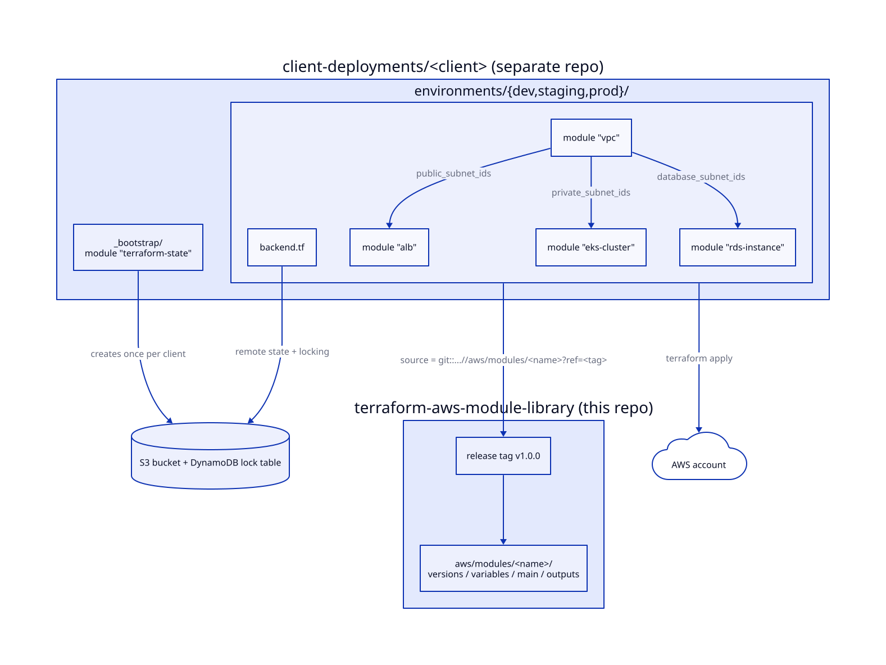

# terraform-aws-module-library

A library of 57 reusable Terraform modules for AWS. The modules cover networking, compute, containers, data stores, serverless, messaging, monitoring and analytics, and they share one set of conventions for inputs, tags and outputs.

I built it as the starting kit for AWS consulting engagements: a client stack is assembled from these modules instead of being written from scratch each time. **Status: the library is built and ready, but it has not yet been applied to a client account.** Treat it as statically validated code, not battle-tested code. See [Validation status](#validation-status).

## Design



Each client gets its own deployment repo. A `_bootstrap/` root module uses `terraform-state` to create the S3 + DynamoDB backend once, and each environment directory points its `backend.tf` at it. Environment root modules pull library modules by git URL pinned to a release tag and wire them together through outputs.

- **One resource family per module.** Modules are small and composable and wire together through outputs (for example, `vpc` subnet IDs flow into `alb`, `eks-cluster` and `rds-instance`).
- **Same file layout everywhere**: `versions.tf` (Terraform >= 1.5.0, AWS provider >= 5.0, < 6.0), `variables.tf` (typed inputs with descriptions and `validation` blocks), `main.tf`, `outputs.tf`, and a `README.md` with usage examples and input/output tables.
- **Standard tags.** Modules merge `ManagedBy = "terraform"` and `Module = "<name>"` into caller-supplied `tags`.
- **Secure defaults**, such as encryption on by default, public access blocks on S3, and IMDSv2 on launch templates. Each module's README lists its specifics.
- **State bootstrap.** `terraform-state` creates the S3 + DynamoDB backend once per client. [docs/architecture-patterns](docs/architecture-patterns/environment-and-state-management.md) records the environment and state layout decisions: directory-per-environment rather than workspaces, and a flexible single-account or multi-account model.

## Modules

| Category | Modules |
|----------|---------|
| Foundation | terraform-state, vpc, nat-gateway, security-group |
| Compute & load balancing | ec2-instance, launch-template, asg, alb, nlb, target-group |
| Storage & database | s3-bucket, efs, ebs-volume, rds-instance, rds-aurora, dynamodb-table, elasticache-redis, elasticache-memcached |
| Security & identity | iam-role, iam-policy, iam-user, iam-instance-profile, kms-key, secrets-manager, acm-certificate |
| Networking (extended) | route53-zone, route53-records, cloudfront, vpc-endpoints, vpc-peering, transit-gateway, transit-gateway-attachment, vpn-gateway |
| Containers | ecr-repository, ecs-cluster, ecs-task-definition, ecs-service, eks-cluster, eks-node-group |
| Serverless | lambda, lambda-layer, api-gateway-rest, api-gateway-http, step-functions, eventbridge-rule |
| Messaging | sqs-queue, sns-topic, sns-subscription |
| Monitoring & logging | cloudwatch-log-group, cloudwatch-alarm, cloudwatch-dashboard, vpc-flow-logs |
| Data & analytics | redshift-cluster, kinesis-stream, kinesis-firehose, glue-catalog-database, athena-workgroup |

[aws/modules/README.md](aws/modules/README.md) has one-line descriptions, and [docs/aws-module-catalog.md](docs/aws-module-catalog.md) shows the order the modules were built in.

## Usage

```hcl
module "vpc" {
  source = "git::https://github.com/defenestratexp/terraform-aws-module-library.git//aws/modules/vpc?ref=v1.0.0"

  name               = "acme-prod"
  cidr_block         = "10.0.0.0/16"
  availability_zones = ["us-east-1a", "us-east-1b"]

  tags = {
    Environment = "production"
  }
}
```

Pin `?ref=` to a release tag. Each module's README has more complete examples, including how to wire it to the modules around it.

## Layout

```
.
├── aws/
│   ├── modules/        # 57 modules, one directory each
│   ├── compositions/   # planned: multi-module stacks (not yet populated)
│   └── examples/       # planned: standalone examples (module READMEs cover this today)
└── docs/
    ├── aws-module-catalog.md
    ├── naming-conventions.md
    └── architecture-patterns/
```

The library covers AWS today. Other clouds may follow, but none of that code exists yet.

## Validation status

The modules have been checked statically but have **not been applied** to a real AWS account.

- `terraform fmt -check -recursive` passes (Terraform 1.14).
- `terraform init -backend=false && terraform validate` passes for all 57 modules on AWS provider 5.100.
- Modules pin the AWS provider to `>= 5.0, < 6.0`. Provider 6.x has breaking changes that affect
  `redshift-cluster` and `vpc-flow-logs`, so 6.x support is not claimed yet.

## Requirements

- Terraform >= 1.5.0
- AWS provider >= 5.0, < 6.0 (some modules also use `hashicorp/tls` or `hashicorp/archive`, as declared in their `versions.tf`)
- AWS credentials for the target account

## Provenance

This library comes from my own infrastructure work. The examples use placeholder values: `example.com`, account `123456789012`, and generic RFC 1918 CIDRs.

## License

MIT. See [LICENSE](LICENSE).
